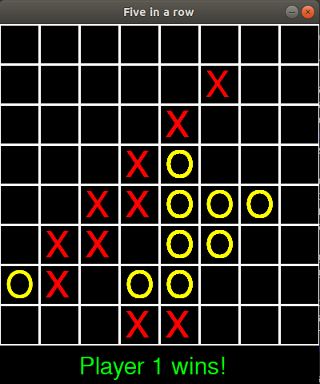

# Five in a row

## Table of Contents
* [General info](#general-info)
* [Screenshots](#screenshots)
* [Technologies](#technologies)
* [Libraries](#libraries)
* [Status](#status)
* [Inspiration](#inspiration)
* [Contact](#contact)

## General info
One of my first projects which is simple Python and Pygame implementation of Five-in-a-row board game for 2 players.

## Screenshots

## Technologies
* Python 3.7.4

## Libraries
* Python: numpy, pygame, sys

## Status
Project is: _finished_

## Inspiration:
TicTacToe (3x3) game from Michael Dawson's book "Python programming for the absolute beginner"; 
Keith Galli's tutorials from YouTube

## Contact
maciej.wilk04@gmail.com
